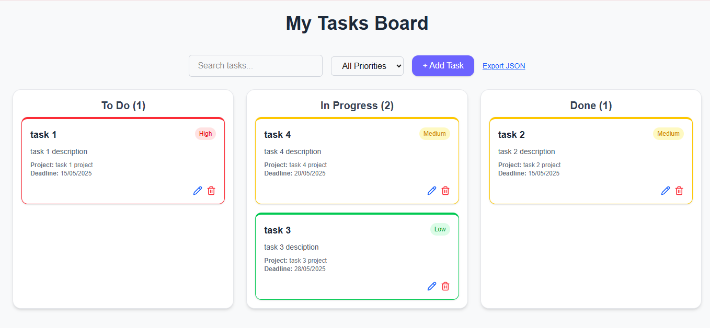

# Trello-style To-Do App

An interactive and responsive task management app inspired by Trello. Built using **Next.js 14**, **TypeScript**, and **@hello-pangea/dnd** for drag-and-drop support.

## Features

- ✅ **Three-column task board**: To Do, In Progress, Done
- ✏️ **Add/Edit tasks** with:
  - Title & Description
  - Deadline
  - Priority (High, Medium, Low)
  - Project name
- ⏳ **Drag & Drop** to move tasks between columns
- 🔍 **Search** and **Priority filter** functionality
- ⚠️ **Overdue task highlighting**
- 💾 **LocalStorage** to persist tasks
- 🌐 **Responsive & Clean UI**

## Tech Stack

- [Next.js 14](https://nextjs.org/)
- [TypeScript](https://www.typescriptlang.org/)
- [Tailwind CSS](https://tailwindcss.com/)
- [@hello-pangea/dnd](https://github.com/hello-pangea/dnd) (drag and drop)

## Getting Started

### 1. Clone the repository

```bash
git clone https://github.com/alaa-alhajj/trello-todo-app.git
cd trello-todo-app
```

### 2. Install dependencies
```bash
npm install
```


### 3. Run the development server
```bash
npm run dev
```
Open http://localhost:3000 in your browser.


## 📸 Preview


---

## 👩‍💻 Author

**Alaa Alhaj**  
🌍 Front-End Developer | Passionate about clean UI & smooth UX  
📫 [LinkedIn](https://www.linkedin.com/in/alaa-alhaj/)  
💻 [GitHub](https://github.com/alaa-alhajj/)

---

## 📄 License

This project is licensed under the MIT License – feel free to use and modify.
